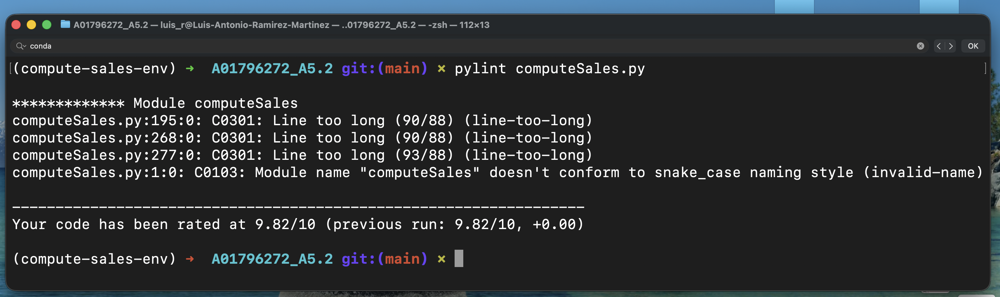
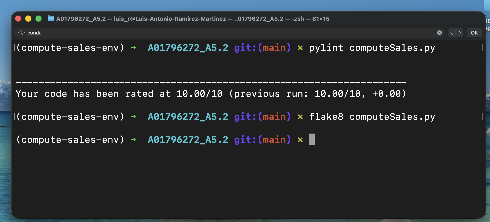

# Instituto Tecnológico de Estudios Superiores de Monterrey
## Maestría en Inteligencia Artificial Aplicada
## Pruebas de software y aseguramiento de la calidad
## 5.2 Ejercicio de programación 2 y análisis estático
### A01796272 - Luis Antonio Ramírez Martínez

## Descripción general
`computeSales.py` es un programa de línea de comandos desarrollado en Python que calcula
el costo total de ventas a partir de dos archivos en formato JSON:

1. Un **catálogo de precios de productos**
2. Un **registro de ventas**

El programa está diseñado para manejar grandes volúmenes de datos, validar entradas,
continuar la ejecución ante errores y cumplir con el estándar de codificación **PEP-8**,
además de ser analizado con **flake8** y **pylint**.

---

## Requisitos

- Python 3.11
- Conda (recomendado)
- flake8
- pylint

---

## Configuración del entorno

### Crear el entorno
```bash
conda env create -f environment.yml
conda activate compute-sales-env
```

### Actualizar un entorno existente
```bash
conda env update -f environment.yml --prune
```

---

## Ejecución del programa

El programa debe ejecutarse desde la línea de comandos con el siguiente formato mínimo:

```bash
python computeSales.py priceCatalogue.json salesRecord.json
```

---

## Archivos de entrada

### 1. Catálogo de precios (`priceCatalogue.json`)

Formatos soportados:
- Lista de productos
- `{ "products": [...] }`
- `{ "items": [...] }`
- `{ "catalogue": [...] }`

Cada producto puede contener:
- Identificador: `title`, `name`, `product`, `id`, `sku`
- Precio: `price`, `cost`, `unit_price`

---

### 2. Registro de ventas (`salesRecord.json`)

El programa soporta dos formatos:

#### A. Ventas anidadas
```json
{
  "sales": [
    {
      "items": [
        {"product": "Apple", "quantity": 2}
      ]
    }
  ]
}
```

#### B. Formato plano (casos de prueba)
```json
[
  {"SALE_ID": 1, "Product": "Apple", "Quantity": 2},
  {"SALE_ID": 1, "Product": "Banana", "Quantity": -1}
]
```

En el formato plano, los registros se agrupan automáticamente por `SALE_ID`.

---

## Salida del programa

El programa:
- Imprime los resultados en pantalla
- Genera el archivo `SalesResults.txt`

### La salida incluye:
- Detalle de productos por venta
- Total por cada venta
- Total general de todas las ventas
- Número de ventas procesadas
- Número de líneas procesadas
- Tiempo total de ejecución

La salida está diseñada para ser **fácilmente legible por el usuario**.

---

## Manejo de errores

El programa implementa un manejo robusto de errores:

- Archivos JSON inválidos detienen la ejecución
- Productos inválidos en el catálogo se reportan y se ignoran
- Productos desconocidos en ventas se reportan y se omiten
- Reglas para cantidades:
  - `cantidad = 0` → inválida, se omite
  - `cantidad < 0` → permitida (devoluciones o ajustes), se reporta como advertencia

El programa **continúa ejecutándose** aun cuando encuentra registros con errores.

---

## Calidad del código y estándares

### Cumplimiento de PEP-8
El código cumple con el estándar PEP-8, utilizando un límite máximo de **88 caracteres por línea**.

---

### Validación con flake8
El código fue validado usando flake8:

```bash
flake8 computeSales.py
```

Resultado esperado:
```
(sin salida)
```

Resultado primera iteración:


---

### Validación con pylint
El código fue analizado usando pylint:

```bash
pylint computeSales.py
```

Algunas advertencias fueron deshabilitadas de forma intencional en el archivo `.pylintrc`:
- `invalid-name`
- `too-many-locals`
- `consider-using-f-string`

Estas advertencias no representan errores funcionales ni lógicos.

Resultado primera iteración:


### Validación final

Resultado final:


---

## Casos de prueba

| Caso de prueba | Total esperado |
|---------------|----------------|
| TC1 | 2,481.86 |
| TC2 | 166,568.23 |
| TC3 | 165,235.37 |

---

## Archivos incluidos

- `computeSales.py`
- `environment.yml`
- `.flake8`
- `.pylintrc`
- `SalesResults.txt`

---

## Conclusión

A través de esta actividad se reforzó la importancia de desarrollar programas de línea de comandos robustos y bien estructurados, capaces de manejar datos reales con formatos variables y posibles inconsistencias. Se aprendió a diseñar soluciones que no solo resuelven el problema funcional, sino que también cumplen con estándares de calidad de código como PEP-8, integrando herramientas de análisis estático como flake8 y pylint para identificar y corregir problemas de estilo, mantenibilidad y buenas prácticas. Finalmente, la actividad permitió valorar la relevancia del manejo de errores, la validación de entradas y la documentación clara como elementos fundamentales para construir software confiable, legible y profesional.
